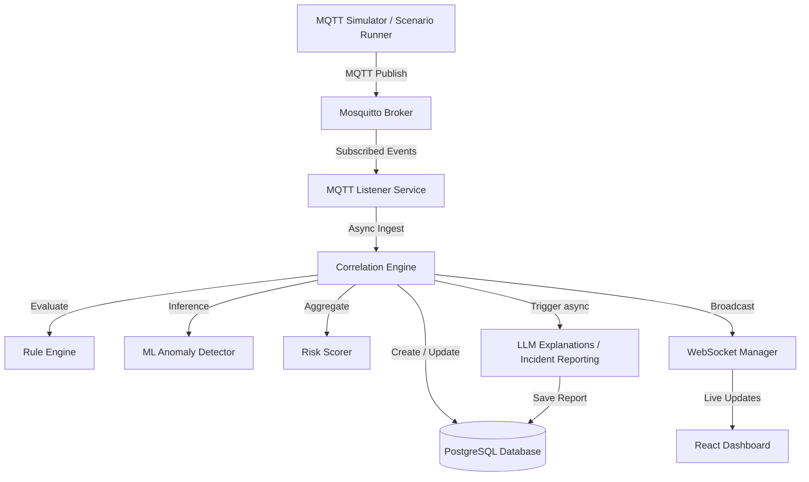

# Architecture & Data Flow

This document details the software architecture and messaging topology for the AI-Powered Industrial Safety Intelligence System.

## System Modules

1. **MQTT Simulator**: Publishes real-time telemetry (gas levels, equipment temperature, work permits, PPE flags) on structured topics (`safety/#`).
2. **FastAPI Backend**: Uses an asynchronous event pipeline. The central `CorrelationEngine` processes incoming events, updates state snapshots, triggers safety rules, runs Isolation Forest anomalies, and computes composite risk ratings.
3. **ML Analytics**: Uses an `Isolation Forest` model to detect multidimensional sensor stream anomalies.
4. **WebSocket Manager**: Maintains client sessions and pushes updates immediately to frontend clients without pooling overhead.
5. **React Dashboard**: Modern dark dashboard displaying animated risk states, SVG layout overlays, live Chart.js timelines, and AI logs.
